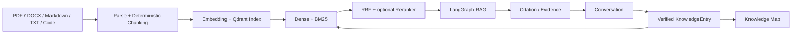

# TraceMind

**一个本地优先、答案可追溯、面向长期学习与技术积累的个人 AI 知识库。**

TraceMind 将 PDF、Markdown、技术文档、代码资料、历史对话和已经验证的解决经验组织为一套能检索、能核验、能恢复、能持续维护的个人知识系统。当前版本为 **v1.1.0**。

[](https://github.com/anlew07/TraceMind/releases/latest)
[](https://github.com/anlew07/TraceMind/actions/workflows/ci.yml)


[](LICENSE)

> 日常价值优先于功能数量。每一份复杂度，都应该证明自己值得存在。

## 当前产品能力

### Evidence-first RAG

TraceMind 使用 Qwen3 Embedding、Qdrant BM25、确定性 RRF 和可选 Cross-Encoder Reranker 组合 Dense + Sparse Hybrid Retrieval。Conversation RAG 支持 Query Rewrite、显式 Document / Path Scope、Top-K Evidence、SSE 流式输出和 Citation Guard。

回答引用来自真实 Document Chunk 或 verified KnowledgeEntry，可继续核对文件名、版本、章节、页码、相对路径或代码行号。RAG Execution Trace 展示阶段、状态、耗时、候选数量和安全降级信息；它是可观测性数据，不是 Chain of Thought / 思维链。

### Conversation 与 Knowledge

Conversation 持久化问题、回答、来源和完成/取消/失败状态。完成的回答可以保存为结构化 `KnowledgeEntry`，维护 Question、Background、Root Cause、Solution、Failed Attempts、Tags、验证状态以及不可变 Evidence Snapshot。

只有当前已验证并成功建立索引的知识条目进入后续 RAG。Knowledge Map 从 PostgreSQL 中的 Knowledge Base、Document、KnowledgeEntry 和 Tag 实时派生关系；它用于浏览，不参与检索，也不是 GraphRAG。

### Retrieval Workspace

独立工作区用于检查 Semantic、Hybrid 或 Reranked 结果、Scope、Rank、RRF score、Reranker raw logit 与 Evidence。它停在候选证据层，不调用 LangGraph 生成回答，也不创建 Conversation。

### Data & Recovery

TraceMind 将 PostgreSQL 长期业务记录与本地 Original Files 视为持久事实来源，将 DocumentChunk、Qdrant 检索索引和任务运行状态视为可重建 Derived State。

- Archive / Restore：导出并验证知识库业务数据、原文件和 Evidence Snapshot。
- Consistency Audit：只读检查 PostgreSQL、Storage、Qdrant 和 Restore Journal 的一致性。
- Safe Repair：仅执行后端重新验证并明确允许的派生状态修复。
- Rebuild Derived State：重新解析文件并重建 Document 与 verified Knowledge 检索索引。

Qdrant 丢失会暂时影响检索，但在 PostgreSQL 与 Original Files 完整时，不等于永久知识丢失。

## 快速开始

### 前置条件

- Git
- Python 3.12
- [uv](https://docs.astral.sh/uv/)
- Node.js 22.18+（或 24.12+）与 npm
- Docker Desktop，或支持 Docker Compose 的 Docker Engine

### 1. 克隆项目

```bash
git clone https://github.com/anlew07/TraceMind.git
cd TraceMind
```

### 2. 准备环境变量

Windows PowerShell：

```powershell
Copy-Item .env.example .env
Copy-Item frontend/.env.example frontend/.env
```

macOS / Linux：

```bash
cp .env.example .env
cp frontend/.env.example frontend/.env
```

打开 `.env`，至少填写 `LLM_BASE_URL` 和 `LLM_MODEL`；远程服务需要凭据时再填写 `LLM_API_KEY`。不要提交 `.env`。

### 3. 启动基础设施

```bash
docker compose up -d postgres redis qdrant
docker compose ps
```

### 4. 启动后端

```bash
cd backend
uv sync --frozen
uv run alembic upgrade head
uv run uvicorn app.main:app --reload
```

- Backend：`http://localhost:8000`
- 开发环境 Swagger：`http://localhost:8000/docs`

### 5. 启动 Celery Worker

在第二个终端进入 `backend`：

```bash
uv run --no-sync celery -A app.worker.celery_app:celery_app worker --loglevel=INFO
```

Windows 本地 CPU Embedding 可使用线程池：

```powershell
uv run --no-sync celery -A app.worker.celery_app:celery_app worker --loglevel=INFO --pool=threads --concurrency=2 --prefetch-multiplier=1
```

### 6. 启动前端

在第三个终端运行：

```bash
cd frontend
npm ci
npm run dev
```

首次访问打开 `http://localhost:5173/`。根路由会先进入 Landing；完成首次入口后再进入 Knowledge Base Workspace。

完整开发、容器和验证说明见 [开发指南](docs/development.md)。

<details>
<summary><strong>可选：启用本地 Reranker</strong></summary>

默认 `RERANKER_ENABLED=false`，不启动 Reranker 仍可使用 Hybrid Retrieval。

```bash
cd backend
uv run --no-sync uvicorn app.reranker_server:app --host 127.0.0.1 --port 8011 --workers 1
```

确认 `http://127.0.0.1:8011/health/ready` 返回 200 后，将 `.env` 中 `RERANKER_ENABLED` 设置为 `true` 并重启 Backend。CPU / CUDA、离线缓存与显存边界见 [Reranker 指南](docs/reranker.md)。

</details>

## 产品工作流



**导入资料 → 检索证据 → 生成回答 → 核验引用 → 保存并验证知识 → 在后续问题中复用。**

## 技术栈

| 层 | 当前实现 |
| --- | --- |
| Backend | Python 3.12、FastAPI、SQLAlchemy 2、Alembic |
| Frontend | Vue 3、TypeScript、Vite、Element Plus、Cytoscape.js |
| Persistent Data | PostgreSQL、本地 Original Files |
| Task Runtime | Redis、Celery |
| Retrieval | Qdrant、Qwen3 Embedding、BM25、RRF、Cross-Encoder Reranker |
| RAG | LangChain、LangGraph、OpenAI-compatible ChatModel、SSE、Citation Guard |
| Deployment | Docker Compose + 本地前端开发服务 |

详细数据流、默认候选数量、Context 上限、Fallback 和 Source of Truth 边界见 [当前系统架构](docs/architecture/TraceMind-Architecture.md)。

## 检索评测

仓库保留固定 synthetic corpus、24 个 case、冻结 baseline 和隔离 Qdrant collection 的检索回归工具。它用于发现同一评测设置下的 Retrieval Regression，不代表所有真实资料上的通用效果，也不能替代回答和引用的人工核验。

现有正式 baseline 属于 v1.0 历史验证；v1.1.0 release cleanup 没有把旧结果包装为新的 v1.1.0 benchmark。数据、指标、隔离要求和运行方式见 [Retrieval Evaluation](docs/retrieval-evaluation/README.md)。

## 当前边界

TraceMind v1.1.0 不是：

- Claude Code / Codex 类 coding agent 或自动改代码工具；
- 通用 Agent / Multi-Agent 平台；
- GraphRAG、图数据库或自动关系生成产品；
- 企业多租户知识平台；
- 云同步、自动备份或外部系统自动执行平台。

代码文件按普通技术文本处理，保留 language、relative path 与 line range，不做 AST、Symbol Scope 或调用图。PDF 只处理可提取文本层，当前无 OCR。

## 文档

- [文档入口](docs/README.md)
- [当前产品](docs/product/TraceMind-Product.md)
- [当前系统架构](docs/architecture/TraceMind-Architecture.md)
- [开发指南](docs/development.md)
- [UI Design](docs/design/TraceMind-UI-Design.md)
- [Knowledge Design](docs/design/TraceMind-Knowledge-Design.md)
- [Retrieval Evaluation](docs/retrieval-evaluation/README.md)
- [v1.1.0 Release Notes](docs/releases/v1.1.0.md)
- [v1.0.0 Release Notes](docs/releases/v1.0.0.md)

## 许可证

TraceMind 使用 [Apache License 2.0](LICENSE)。
