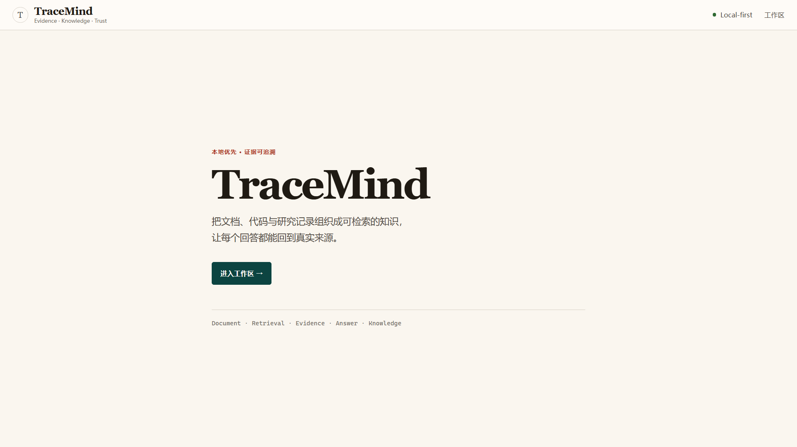
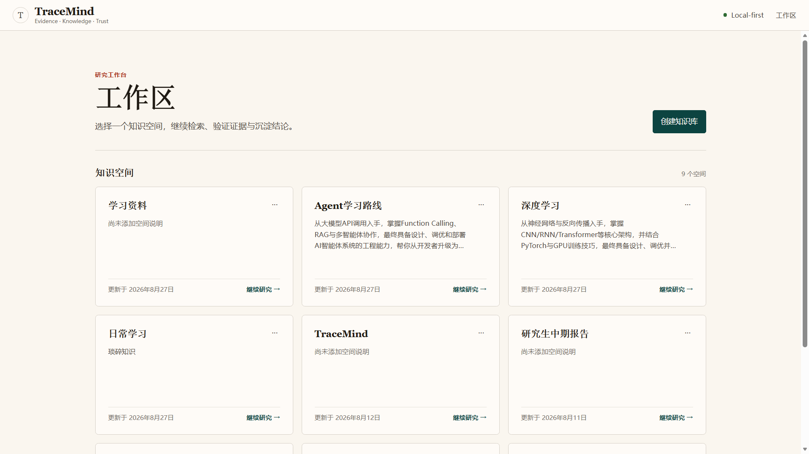
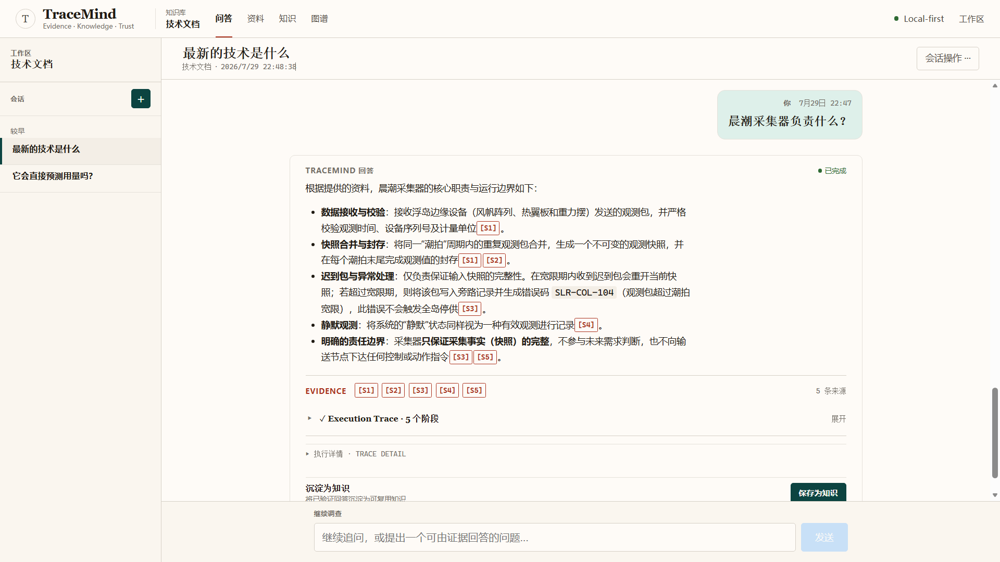
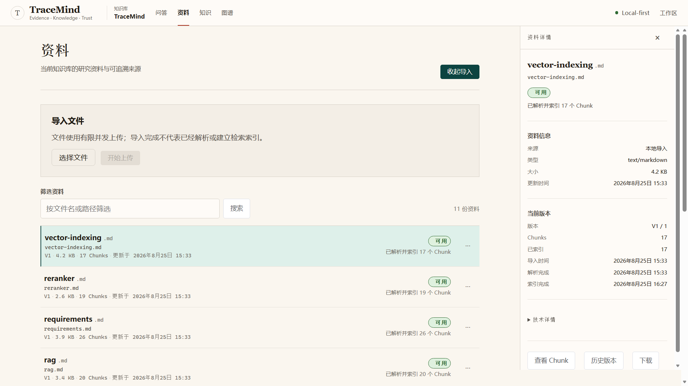
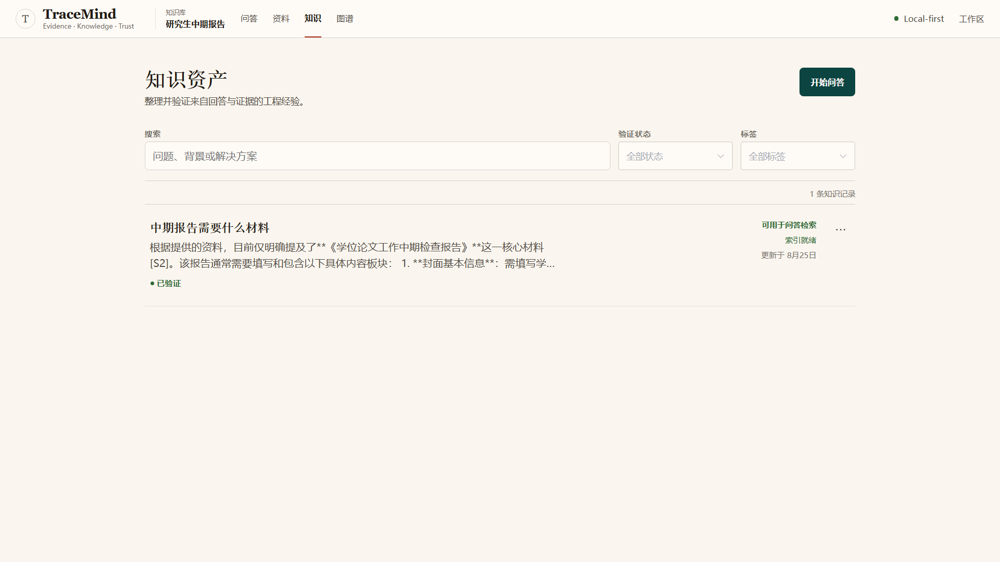
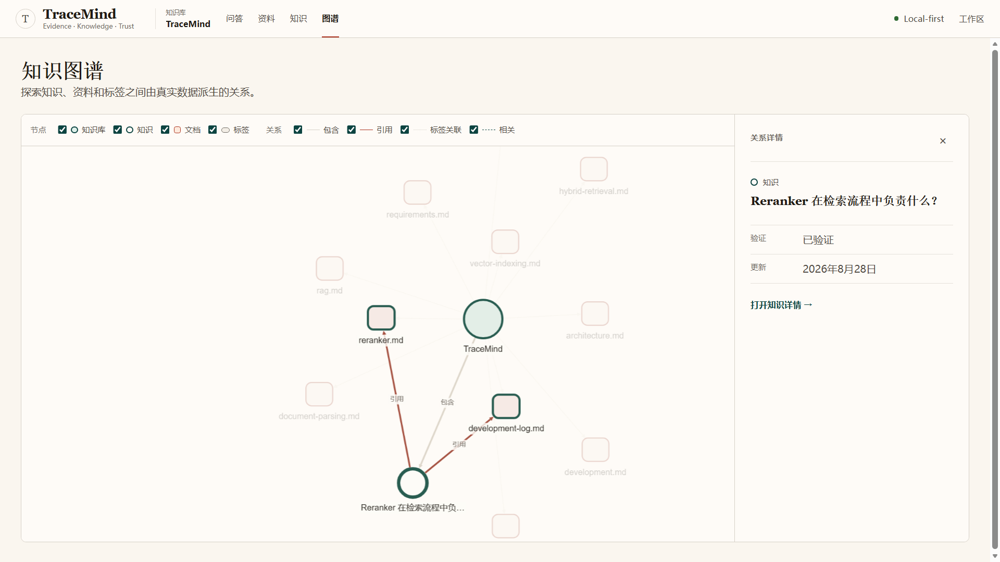
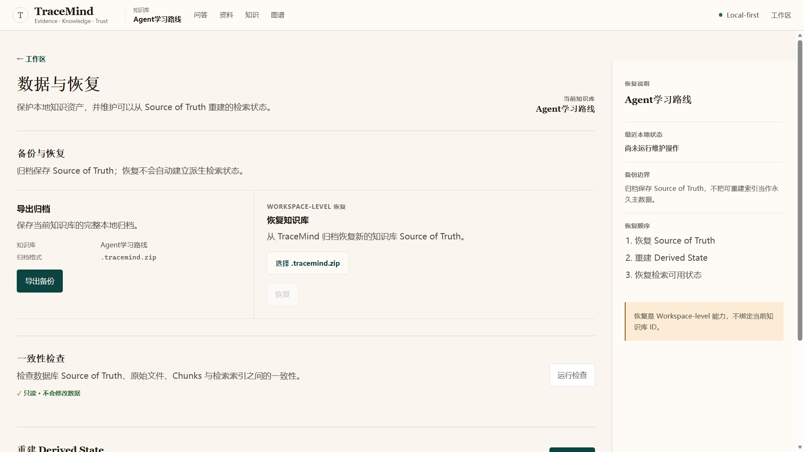
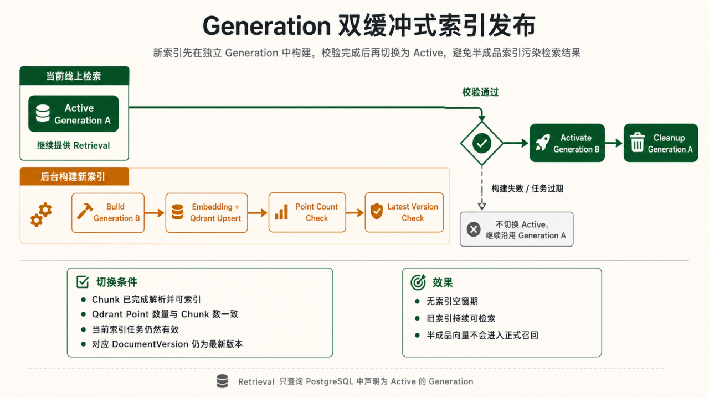

# TraceMind 项目说明

**一个本地优先、答案可追溯、面向长期学习与技术积累的个人 AI 知识库。**

TraceMind 将 PDF、DOCX、Markdown、TXT、技术代码资料、历史对话和已经验证的问题解决经验组织为一套能够**检索、核验、沉淀、恢复和持续维护**的个人知识系统。

当前版本：**v1.1.0**

<p align="center">      <br>   <sub><b>TraceMind Overview</b>：本地优先的个人 AI 知识库整体界面。</sub> </p>

## 快速开始

TraceMind 本地运行主要包含四部分：

- **PostgreSQL**：保存知识库、文档、Conversation、KnowledgeEntry 等长期业务数据。
- **Redis + Celery**：执行文档解析、Embedding、索引、重建等异步任务。
- **Qdrant**：保存 Dense 与 BM25 检索索引。
- **Backend + Frontend**：分别提供 FastAPI API 和 Vue 用户界面。

正常开发时建议准备 **3 个终端**，分别运行 Backend、Celery Worker 和 Frontend。

### 1) 前置条件

请先安装：

- Git
- Python `3.12`
- [uv](https://docs.astral.sh/uv/)：Python 依赖与虚拟环境管理
- Node.js `22.18+`（或 `24.12+`）与 npm
- Docker Desktop，或支持 Docker Compose 的 Docker Engine

可以先确认本地环境：

```
git --version
python --version
uv --version
node --version
npm --version
docker --version
docker compose version
```

### 2) 克隆项目

```
git clone https://github.com/anlew07/TraceMind.git
cd TraceMind
```

后续命令默认都从项目根目录执行。

### 3) 准备环境变量

项目不会把本地 API Key、数据库密码等配置直接写入代码，需要先根据示例文件创建本地 `.env`。

Windows PowerShell：

```
Copy-Item .env.example .env
Copy-Item frontend/.env.example frontend/.env
```

macOS / Linux：

```
cp .env.example .env
cp frontend/.env.example frontend/.env
```

打开根目录 `.env`，至少配置 Chat Model：

```
# OpenAI-compatible API 地址
LLM_BASE_URL=


# 实际使用的模型名称
LLM_MODEL=
```

如果 Provider 需要鉴权，再填写：

```
LLM_API_KEY=
```

TraceMind 使用 OpenAI-compatible ChatModel，因此可以接入提供兼容接口的本地或远程模型服务。

> `.env` 用于保存本地运行配置和凭据，不要提交到 Git。

Embedding、Qdrant、PostgreSQL、Redis、Chunk Size、Retrieval Top-K 等参数已经在 `.env.example` 中提供默认值，首次运行通常不需要修改。

### 4) 启动 PostgreSQL、Redis 和 Qdrant

TraceMind 将基础设施放在 Docker Compose 中运行：

```
docker compose up -d postgres redis qdrant
```

检查容器状态：

```
docker compose ps
```

三个服务分别负责：

```
PostgreSQL
└─ 长期业务数据


Redis
└─ Celery Broker / Result Backend


Qdrant
└─ Dense + BM25 检索索引
```

确认对应容器处于正常运行状态后，再启动 Backend。

### 5) 启动后端

进入 Backend：

```
cd backend
```

安装并同步锁定版本的 Python 依赖：

```
uv sync --frozen
```

其中 `--frozen` 表示严格按照当前 `uv.lock` 安装依赖，避免本地环境自动改变锁文件。

初始化或升级 PostgreSQL 数据库结构：

```
uv run alembic upgrade head
```

启动 FastAPI：

```
uv run uvicorn app.main:app --reload
```

启动成功后访问：

- Backend：`http://localhost:8000`
- Swagger：`http://localhost:8000/docs`

`--reload` 仅用于本地开发，代码修改后 Backend 会自动重新加载。

### 6) 启动 Celery Worker

**保持 Backend 终端运行**，再打开第二个终端。

进入：

```
cd TraceMind/backend
```

启动 Celery Worker：

```
uv run --no-sync celery -A app.worker.celery_app:celery_app worker --loglevel=INFO
```

Celery Worker 负责执行不适合阻塞普通 HTTP 请求的耗时任务，例如：

```
Document Parse
→ Chunk
→ Embedding
→ Qdrant Index


KnowledgeEntry Index


Consistency Repair


Derived State Rebuild
```

因此：

> Backend 可以正常启动并不代表文档索引任务能够执行，进行资料导入时需要同时运行 Celery Worker。

Windows 本地使用 CPU Embedding 时，推荐线程池模式：

```
uv run --no-sync celery -A app.worker.celery_app:celery_app worker --loglevel=INFO --pool=threads --concurrency=2 --prefetch-multiplier=1
```

这里：

- `--pool=threads`：Windows 本地使用线程池；
- `--concurrency=2`：同时执行两个 Worker Thread；
- `--prefetch-multiplier=1`：减少单个 Worker 预取过多耗时任务。

### 7) 启动前端

保持 Backend 和 Celery Worker 继续运行，再打开第三个终端：

```
cd TraceMind/frontend
```

安装锁定版本的前端依赖：

```
npm ci
```

启动 Vite 开发服务器：

```
npm run dev
```

访问：

```
http://localhost:5173/
```

首次访问会进入 Landing，之后进入 Knowledge Base Workspace。

此时本地运行结构大致为：

```
Terminal 1
└─ FastAPI Backend :8000


Terminal 2
└─ Celery Worker


Terminal 3
└─ Vue / Vite Frontend :5173


Docker Compose
├─ PostgreSQL
├─ Redis
└─ Qdrant
```

完整开发、容器和验证说明见 [开发指南](docs/development.md)。

**可选：启用本地 Cross-Encoder Reranker**

Reranker **不是 TraceMind 运行的必需组件**。

默认：

```
RERANKER_ENABLED=false
```

此时检索链路仍然可以正常执行：

```
Dense + BM25
      ↓
     RRF
      ↓
Top-K Evidence
```

启用 Reranker 后，则变为：

```
Dense + BM25
      ↓
     RRF
      ↓
Cross-Encoder Reranker
      ↓
Top-K Evidence
```

如果需要启用，在新的终端中进入 Backend：

```
cd backend
```

启动本地 Reranker Server：

```
uv run --no-sync uvicorn app.reranker_server:app --host 127.0.0.1 --port 8011 --workers 1
```

确认健康检查：

```
http://127.0.0.1:8011/health/ready
```

返回 `200` 后，将根目录 `.env` 中：

```
RERANKER_ENABLED=true
```

然后重启 Backend。

默认模型为：

```
Qwen/Qwen3-Reranker-0.6B
```

CPU / CUDA、模型离线缓存、dtype、batch size 与显存边界见 [Reranker 指南](docs/reranker.md)。

## 项目概览

- **核心能力**：
  - 多格式文档导入、解析与索引。
  - 混合检索、重排序、查询改写与范围过滤。
  - RAG 流式回答与可追溯引用。
  - 对话持久化、知识沉淀与检索复用。
  - 检索调试、知识浏览与数据恢复。
- **运行方式**：Vue 3 + FastAPI，PostgreSQL 保存业务数据，Redis + Celery 执行异步任务，Qdrant 提供检索能力。

<p align="center">      <br>   <sub><b>Knowledge Base Workspace</b>：统一进入文档、检索、对话与知识管理。</sub> </p>

## 关键技术亮点

- **文档多版本管理**：上传时通过 SHA-256 校验去重，原文件原子持久化后创建 Document Version；Celery 异步解析，执行确定性切分、Embedding 与 Qdrant 入库。内容未变则复用已有版本与已生效索引，内容更新则创建新版本，解析和索引状态各自独立追踪。
- **双缓冲式索引发布**：采用 Active / Building Generation 隔离新旧索引，新索引完成向量化入库与 Point Count 完整性校验后再切换 Active；构建失败自动沿用旧 Generation，避免部分写入污染线上召回结果。
- **Dense + BM25 双路混合检索**：Qwen3 Embedding 负责语义召回，Qdrant BM25 负责 API 名称、错误信息、代码标识符和专有名词的精确匹配，两路联合召回，兼顾语义理解与关键词命中。
- **确定性 RRF 排序融合**：Dense 和 BM25 的候选结果在应用层通过 RRF（倒数排名融合）统一排序，并用稳定键消除同分抖动，确保混合检索结果可重复、可测试。
- **Cross-Encoder 二阶段精排**：先由 Dense+BM25 和 RRF 扩大候选覆盖面，再用 Qwen3 Cross-Encoder 对 Query 与候选文档重新评分，筛选出 Top‑K Evidence，在召回率与最终证据相关性之间做到两阶段平衡。
- **Reranker 自动降级**：Cross‑Encoder 独立部署为微服务，若连接失败、超时、OOM 或响应异常，自动回退到 Hybrid RRF 结果，精排异常不影响基础检索链路。
- **Query 改写与 Scope 限定**：连续对话中按需将上下文相关问题重写为独立检索 Query；同时支持按文档或路径限定召回范围，适配追问、定向资料查询和代码检索场景。
- **Evidence‑first 证据链**：全链路严格遵循“检索→证据→上下文→LLM→引用”顺序，真实来源身份始终保留。回答中的引用可追溯到 Document Version、章节、页码、相对路径或代码行，实现答案到原始资料的可核验定位。
- **Citation Guard 引用校验**：模型生成的引用不被直接采信，而是与本轮实际进入上下文的 Evidence 进行比对过滤，阻止未召回来源被包装成有效引用。
- **LangGraph 显式 RAG 编排**：Route → Scope → Rewrite → Retrieve → Rerank → Context → Grounded Generation / No-answer → Finalize，将完整 RAG 流程拆分为显式节点，支持节点级状态管理、异常处理与执行观测。
- **全链路实时可观测**：记录 Query 改写、检索、重排、上下文构建、LLM 生成及引用校验各阶段的状态、耗时、候选数量、Scope 和降级信息，问题出在哪一阶段一目了然。
- **SSE 流式执行链路**：LangGraph 执行过程实时映射为 Pipeline → Sources → Token → No-answer / Done 等 SSE 事件，前端在答案生成过程中即可同步展示检索阶段、证据来源与流式内容。
- **独立检索工作区**：语义/混合/重排序检索链路可脱离 LLM 单独运行，直接展示排名、RRF 分数、重排分数、Scope 和证据，无需创建对话即可快速定位召回或重排问题。
- **对话→已验证知识闭环**：RAG 问答经人工验证后生成结构化 KnowledgeEntry（含背景、根因、方案、失败尝试、标签及证据快照），重新 Embedding 并入库，使解决过的问题持续沉淀并复用。
- **事实数据与派生状态分层**：PostgreSQL 和原始文件作为唯一事实来源，DocumentChunk、Qdrant 索引和任务运行状态均为可重建的派生状态；向量库只负责检索，不作为知识的唯一真相。
- **数据一致性与灾难恢复链路**：Archive / Restore → Consistency Audit → Safe Repair → Rebuild Derived State；当 Qdrant 索引损坏或丢失时，可基于 PostgreSQL 与原始文件重新执行 Parse → Chunk → Embedding → Index 恢复检索状态。

## 目录与架构

- **后端：** `backend/`
  - 基于 FastAPI，核心代码位于 `backend/app/`，整体采用 API → Service → Repository / Infrastructure 的分层方式，RAG、检索、解析和异步任务保持独立模块。
  - `app/api/`：**接口层**
    - 聚合 Knowledge Base、Document、Conversation、Retrieval、RAG、Knowledge、Archive / Restore 等 HTTP 与 SSE 接口，主要负责参数校验、响应转换、流式事件输出与安全错误映射。
  - `app/rag/`：**RAG 执行链路**
    - 基于 LangGraph 组织 Route → Scope → Rewrite → Retrieve → Rerank → Context → Generate / No-answer → Finalize。
    - `graph.py / nodes.py / state.py` 分别负责工作流编排、节点实现与单次执行状态；`context.py / citations.py` 负责上下文构建和引用约束。
  - `app/services/`：**核心业务编排**
    - 承载文档版本、对话、KnowledgeEntry、索引发布、归档恢复、一致性检查和数据重建等核心流程。
    - 负责事务边界、跨存储补偿和任务调度，避免业务逻辑直接堆积在 API 层。
  - `app/parsing/`：**文档解析与切分**
    - 支持 PDF、DOCX、Markdown、TXT 与常见代码文件，并保留页码、章节或代码行等来源信息。
    - `chunker.py` 负责确定性 Chunking，使相同输入能够稳定生成相同顺序和内容的 Chunk。
  - `app/indexing/`：**向量索引与混合检索**
    - 封装 Qdrant Collection、Dense + BM25 双路召回、确定性 RRF、Payload Filter 等底层索引与检索能力。
    - Generation 的构建、校验与 Active 切换由 Service 层负责业务编排；`app/embedding/` 与 `app/reranker/` 分别提供 Embedding 与可选 Cross-Encoder 精排。
  - `app/tasks/` + `app/worker/`：**异步任务**
    - 基于 Celery + Redis 执行 Parse、Document Index、Knowledge Index、Repair 和 Rebuild，避免耗时任务阻塞 FastAPI 请求。
  - `app/storage/`：**原始文件与数据恢复**
    - 管理 Original Files、Trash、Archive / Restore，并负责原子写入、安全路径和恢复过程中的文件处理。
  - `models/`、`repositories/`、`schemas/`
    - 分别负责 SQLAlchemy 数据模型、PostgreSQL 数据访问和 Pydantic 接口模型，使数据库、业务逻辑和 HTTP 数据结构保持分离。
  - `integrations/`、`db/`、`core/`、`llm/`
    - 统一封装 PostgreSQL、Redis、Qdrant、配置、日志和 ChatModel 等基础设施依赖。
- **前端：** `frontend/`
  - 基于 Vue 3 + TypeScript + Vite + Element Plus 构建，围绕 Knowledge Base Workspace 组织文档、检索、对话、知识沉淀与数据恢复页面。
  - **RAG 流式交互与执行追踪**
    - `ConversationView.vue`：承载 RAG 对话、Evidence 引用和 Execution Trace，实时展示 Query Rewrite、Retrieval、Rerank、Evidence、Generation 等执行阶段。
    - `services/rag.ts`：消费后端 SSE 流，将 Pipeline、Sources、Token、No-answer、Done 等事件实时映射到前端状态。
  - **检索结果可视化**
    - `SemanticSearchPanel.vue`：独立展示 Semantic / Hybrid / Reranked 检索结果，可查看 Rank、RRF Score、Reranker Score 与对应 Evidence。
    - `EvidenceSourceList.vue`：展示回答引用的 Evidence，以及文档、页码、文件路径或代码位置等来源定位信息。
  - **文档生命周期管理**
    - `DocumentView.vue` 配合 `DocumentVersionDialog.vue`、`DocumentChunkDialog.vue`，展示文档版本、解析 / 索引状态以及实际 Chunk 内容。
  - **知识与数据维护**
    - Knowledge / Knowledge Map 页面负责 Verified Knowledge 浏览与关系展示；Data Management 页面统一提供 Archive / Restore、Audit / Repair 与 Rebuild 操作。
- **运行时数据**
  - `data/uploads/`：保存用户上传的原始文档，运行时自动创建，不纳入 Git 版本管理。
  - PostgreSQL、Redis、Qdrant 数据通过 Docker Volume 持久化。
- **基础设施**
  - PostgreSQL：业务数据与知识记录。
  - Qdrant：Dense + BM25 检索索引。
  - Redis + Celery：异步任务与任务状态。
  - `compose.yaml`：统一编排本地依赖服务。

## 核心流程

### 1) 项目全链路（端到端）

1. 用户创建或进入 Knowledge Base，上传 PDF、DOCX、Markdown、TXT 或代码文件。
2. FastAPI 保存原始文件并创建 Document / DocumentVersion，随后通过 Celery 异步执行文档解析、Chunk 切分和索引构建。
3. 文档完成索引后，可以在 Retrieval Workspace 中直接检查 Dense / Hybrid / Reranked 检索结果，也可以进入 Conversation 发起 RAG 问答。
4. 前端调用 `POST /api/v1/knowledge-bases/{knowledge_base_id}/rag/stream`，FastAPI 在 `backend/app/api/routes/rag.py` 中启动 LangGraph 流式执行。
5. LangGraph 依次完成检索范围解析、Query Rewrite、Dense + BM25 混合召回、RRF 融合和可选 Cross-Encoder Rerank，得到最终 Evidence。
6. Evidence 被组织为受控 Context，LLM 基于真实来源流式生成回答；`pipeline`、`sources`、`token`、`no_answer`、`done` 等 SSE 事件同步推送到前端。
7. 对已经解决的问题，用户可以进一步整理为 KnowledgeEntry；验证并完成索引后，它会与原始 Document 一起参与后续 Retrieval，形成“检索 → 解答 → 验证 → 沉淀 → 再检索”的知识闭环。

### 2) RAG 全链路（重点）

1. **请求路由**：`route`

   - 明确的寒暄类问题由本地规则直接走 Direct Generation，不查询知识库。
   - 其余问题进入完整 RAG 分支，继续执行 Scope、Rewrite 和 Retrieval。
   - Direct 分支不会伪造知识库来源或 Citation。

2. **检索范围解析**：`resolve_scope`

   - 支持通过 Document 或文件路径限定检索范围。
   - 指定 Scope 时只查询对应文档；未指定时，从当前 Knowledge Base 中有效的 Document 与 Verified KnowledgeEntry 统一召回。
   - Scope 只限制候选来源，不改变后续混合检索流程。

3. **上下文查询改写**：`rewrite`

   - 没有 Conversation History 时直接使用当前 Query。
   - 存在上下文依赖时，由 ChatModel 判断 `keep / rewrite`，将“这个呢”“上一种方法呢”等追问改写成可独立用于检索的问题。
   - Rewrite 只用于 Retrieval，不修改用户原始问题。
   - 模型超时、调用失败或返回无效结果时自动退回原 Query，不中断后续链路。

4. **混合检索**：`retrieve`

   - 使用 Qwen3 Embedding 对 Query 进行一次向量化。
   - Qdrant 同时执行 Dense 语义召回与 BM25 关键词召回。
   - Dense 负责语义相近内容，BM25 补充 API 名称、异常信息、代码标识符、配置项和专有名词等精确匹配场景。
   - 两路候选在应用层通过确定性 RRF（Reciprocal Rank Fusion，倒数排名融合）统一排序，得到第一阶段候选结果。
   - 同时记录 Dense / Sparse 候选数量以及 Embedding、Qdrant、Fusion 等检索耗时。

5. **二阶段精排**：`rerank`

   - 启用 Reranker 时，将 RRF 候选交给 Qwen3 Cross-Encoder，重新计算 Query 与候选正文之间的相关性并截取最终 Top-K。
   - Reranker 未启用时直接使用 Hybrid 结果。
   - 连接失败、超时、OOM 或服务异常时自动回退 Hybrid RRF，不让可选精排能力阻断基础 RAG。

6. **Evidence 构建与答案生成**：`prepare_context` / `generate_grounded`

   - 最终检索结果转换为带 `[S1] / [S2] / ...` 编号的 Evidence，并在上下文长度限制内组织为 Context。
   - Evidence 保留文档版本、章节、页码、文件路径或代码行等真实来源信息。
   - 没有有效 Evidence 时进入 `no_answer`，直接返回资料不足，不让模型脱离知识库强行生成。
   - 有 Evidence 时流式生成回答，`StreamingCitationGuard` 只允许模型引用本轮真实提供的 Source ID，过滤无效 Citation。

7. **可观测追踪**

   - LangGraph 将执行过程映射为 `routing → query_rewrite → retrieval → rerank → evidence → generation`。
   - 各阶段记录 `started / completed / skipped / fallback / failed` 状态。
   - Execution Trace 同时保留检索模式、候选数量、Scope、Query Rewrite、Reranker Fallback 和各阶段耗时，用于定位问题发生在召回、排序、Evidence 还是最终生成。

<p align="center">      <br>   <sub><b>Conversation & Evidence</b>：RAG 对话、执行过程与可追溯 Evidence。</sub> </p>

### 3) 文档入库链路

1. 前端上传文件到 `POST /api/v1/knowledge-bases/{knowledge_base_id}/documents`，后端校验文件名、扩展名和大小，并在流式写入过程中计算 SHA-256。
2. `DocumentService.import_document` 根据规范化路径识别同一逻辑 Document：
   - 内容 Hash 未变化 → 返回 `unchanged`，不重复创建版本。
   - 内容发生变化 → 创建新的 DocumentVersion，并保留历史版本。
3. `DocumentParsingService.parse_version` 根据文件类型调用对应 Parser，提取正文以及页码、章节或代码行号等来源信息。
4. `DeterministicChunker` 执行单层确定性切分，相同输入和配置会稳定产生相同顺序、正文和 Hash 的 Chunk；当前默认 `1800 chars + 200 overlap`。
5. Parse 成功后自动进入 Index Task，Qwen3 Embedding 生成 Dense Vector，同时构造 BM25 检索文本和 Citation Payload 写入 Qdrant。
6. 新索引使用独立 Generation 构建，全部 Point 写入并通过完整性校验后才切换为 Active；之后新文档即可正式参与 Retrieval。

<p align="center">      <br>   <sub><b>Document Library</b>：查看文档、版本以及 Parse / Index 状态。</sub> </p>

### 4) Generation 索引发布机制

- **隔离构建**：每次索引任务生成新的 Generation，旧 Active Generation 在新索引构建期间继续提供检索，新旧索引不会在构建过程中混用。
- **校验后切换**：只有新 Generation 完成全部 Point 写入、数量校验且仍对应最新 DocumentVersion 后，才切换为 Active；构建失败时继续使用旧索引。
- **有效索引约束**：Retrieval 只查询 PostgreSQL 声明的 Active Generation，因此失败任务或 Qdrant 中残留的孤立 Point 不会自动进入正式 Evidence。

### 5) KnowledgeEntry 知识沉淀链路

1. 用户可以从一条已经完成的 RAG 回答创建 KnowledgeEntry。
2. KnowledgeEntry 将一次问答整理为 Question、Background、Root Cause、Solution、Failed Attempts、Tags 等结构化知识。
3. 创建时同时保存原始 Question / Answer、实际 Citation Evidence 与 Generation Metadata Snapshot，使沉淀后的知识不再完全依赖原 Conversation。
4. 只有 `verified` 的 KnowledgeEntry 才进入索引队列；未验证内容仅作为草稿保存，不参与正式 Retrieval。
5. 索引完成后，Verified KnowledgeEntry 与 Document 一起进入后续混合检索，使已经解决过的问题能够被再次召回和复用。

<p align="center">      <br>   <sub><b>Knowledge Storage</b>：将已验证问题整理为可复用 KnowledgeEntry。</sub> </p>

<p align="center">      <br>   <sub><b>Knowledge Map</b>：浏览知识条目之间的关系与关联。</sub> </p>

### 6) 数据恢复链路

1. **Archive / Restore**：归档 Knowledge Base、Document / DocumentVersion、Original Files、Conversation、KnowledgeEntry 和必要快照；Chunk、Vector 和模型缓存不作为核心事实数据保存。
2. **Consistency Audit**：只读检查 PostgreSQL、Original Files 与 Qdrant Generation / Payload 之间是否存在缺失或状态不一致。
3. **Safe Repair**：只修复允许自动恢复的派生状态，不修改用户正文和知识内容。
4. **Rebuild**：基于 PostgreSQL + Original Files 重新执行 Parse → Chunk → Embedding → Index，Document 与 Verified KnowledgeEntry 都可以重新建立检索索引。
5. 因此即使 Qdrant Collection 损坏或丢失，只要长期业务数据和原始文件仍然完整，Retrieval State 就可以重新构建。

<p align="center">      <br>   <sub><b>Data Recovery</b>：Archive / Restore、Audit / Repair 与 Derived State Rebuild。</sub> </p>

## 技术栈

- **后端**：Python 3.12、FastAPI、SQLAlchemy 2、Alembic。
- **前端**：Vue 3、TypeScript、Vite、Element Plus、Cytoscape.js。
- **长期数据**：PostgreSQL、本地 Original Files。
- **异步任务**：Redis、Celery。
- **检索**：Qdrant、Qwen3 Embedding、BM25、RRF、Cross-Encoder Reranker。
- **RAG**：LangChain、LangGraph、OpenAI-compatible ChatModel、SSE、Citation Guard。
- **部署**：Docker Compose + 本地前端开发服务。

运行、配置、测试与数据维护说明见 [开发指南](docs/development.md)；产品边界见 [当前产品](docs/product/TraceMind-Product.md)。

## RAG 与检索 — 技术细节

### 1. LangGraph Custom Stream 与 SSE 实时执行流

TraceMind 不等待整个 RAG 流程结束后一次性返回结果，而是把 LangGraph 的执行阶段、Evidence 和 LLM Token 统一映射为 SSE（Server-Sent Events，服务端推送事件）流。

后端通过 LangGraph `stream_mode="custom"` 执行工作流，各节点按阶段输出不同类型的事件：

- `pipeline`：Query Rewrite、Retrieval、Rerank、Evidence、Generation 等执行阶段和状态。
- `sources`：本轮真正进入 Context 的 Evidence。
- `token`：LLM 流式生成的回答片段。
- `no_answer`：没有足够 Evidence 时的终止结果。
- `done`：本轮检索模式、候选数量、耗时、Citation 等最终元数据。

FastAPI 在 `backend/app/api/routes/rag.py` 中将这些事件转换为 `text/event-stream` 返回前端，并在流结束、失败或客户端取消时完成 Conversation 状态收口。

前端 `frontend/src/services/rag.ts` 使用 `fetch + ReadableStream + eventsource-parser` 解析 POST SSE，再把不同事件分发给对应 Handler：

```
if (event.event === 'pipeline') handlers.onPipeline(...)
else if (event.event === 'sources') handlers.onSources(...)
else if (event.event === 'token') handlers.onToken(...)
else if (event.event === 'no_answer') handlers.onNoAnswer(...)
else if (event.event === 'done') handlers.onDone(...)
```

请求取消由 `AbortController` 负责，因此前端既可以实时展示 RAG 执行状态，也可以在同一条 Assistant Message 中持续追加最终回答，而不需要额外轮询后端任务状态。

### 2. Qdrant Hybrid Search 与 Deterministic RRF

TraceMind 的第一阶段检索同时执行 Dense 与 BM25 两条召回链路：

- **Dense Path**：使用 Qwen3 Embedding 将 Query 转换为 Dense Vector，Qdrant 通过 Cosine Similarity 执行语义检索。
- **BM25 Path**：Chunk 写入索引时同时构造 Sparse Text，Qdrant 使用 Sparse Vector + IDF 完成关键词召回。
- **统一过滤**：两路检索使用相同的 Knowledge Base、Document、Generation、Language 等 Payload Filter，保证参与融合的候选来自同一检索范围。

`backend/app/indexing/qdrant.py` 通过 `query_batch_points` 一次发起 Dense / Sparse 两个 QueryRequest，再在应用层执行确定性 RRF（Reciprocal Rank Fusion，倒数排名融合）。

RRF 不直接比较两路原始 Score，而是按各自排名计算融合分数：

```
RRF Score = Σ 1 / (k + rank)
```

当前实现使用 `k=2`，并使用由 Relative Path、Line、Chunk Index、Content Hash 等组成的稳定排序键处理同分结果。

这样可以避免 Dense Score 与 BM25 Score 量纲不同导致的权重调参问题，同时保证相同输入下的融合顺序稳定可复现，便于 Retrieval Regression 和问题定位。

### 3. 前端 RAG Execution Trace 状态映射

TraceMind 前端不会展示模型私有思维链，而是把后端返回的 RAG Pipeline Event 映射为可观测的 Execution Trace。

`frontend/src/views/ConversationView.vue` 维护以下主要阶段：

- Query Rewrite
- Retrieval
- Rerank
- Evidence
- Generation

每个阶段根据后端 `pipeline` Event 映射为：

```
pending
started   → running
completed → complete
skipped
fallback
failed
```

实时执行时：

- `pipeline` 更新当前阶段状态；
- `sources` 写入本轮 Evidence；
- `token` 持续追加到同一个 Assistant Message；
- `done` 保存最终 Generation Metadata；
- `error / cancel` 会将正在执行的阶段收口为失败或取消状态。

历史消息重新打开时，前端会根据已经持久化的 Generation Metadata 还原 Query Rewrite、Retrieval、Rerank、Evidence 和 Generation 的执行结果。

因此 Execution Trace 展示的是“系统执行到了哪里、使用了什么检索模式、是否发生降级”，而不是模型内部推理过程。

### 4. Generation 双缓冲式索引发布

文档更新时，TraceMind 不直接删除当前索引再重新写入，而是为每次 Index Attempt 创建新的 `generation UUID`。

<p align="center">      <br>   <sub><b>Generation 双缓冲式索引发布</b>：新 Generation 独立构建并校验，通过后再切换 Active。</sub> </p>

新 Generation 在后台独立完成 Embedding 和 Qdrant Upsert，期间旧 Active Generation 仍然可以正常参与 Retrieval。

只有同时满足以下条件，新 Generation 才会切换为 Active：

- 当前 Version 已完成 Parse，并存在有效 Chunk；
- 新 Generation 的 Point 已全部写入 Qdrant；
- Point Count 与当前 Chunk Count 一致；
- 当前 Index Attempt 仍然有效；
- 对应 DocumentVersion 仍然是当前最新版本。

如果新索引构建失败或任务已经过期，则不会切换 Active Generation，旧索引继续提供检索。

Retrieval 只查询 PostgreSQL 中声明为 Active 的 Generation，因此失败任务、过期任务或 Qdrant 中残留的孤立 Point 不会自动进入正式 Evidence。

这种设计避免了文档重新索引期间出现“旧索引已删除、新索引还未构建完成”的不可检索窗口，同时也避免半完成索引污染当前检索结果。

## 检索评测

当前仓库保留 v1.0 固定检索集上的历史 Hybrid Retrieval Baseline：

| 指标           |   结果 |
| -------------- | -----: |
| Recall@5       | 84.09% |
| MRR@5          | 73.64% |
| nDCG@5         | 65.72% |
| All-required@5 | 81.82% |
| Hit@5          |   100% |
| P95 Latency    | 375 ms |

> 该结果来自固定 synthetic corpus 与 24 个 Case，仅用于同一评测设置下的 Retrieval Regression 对比，不代表真实知识库上的通用效果。v1.1.0 尚未重新生成新的正式 Benchmark。

详细评测说明见 [Retrieval Evaluation](docs/retrieval-evaluation/README.md)。

## 文档

- [文档入口](docs/README.md)
- [当前产品](docs/product/TraceMind-Product.md)
- [开发指南](docs/development.md)
- [UI Design](docs/design/TraceMind-UI-Design.md)
- [Knowledge Design](docs/design/TraceMind-Knowledge-Design.md)
- [Retrieval Evaluation](docs/retrieval-evaluation/README.md)
- [v1.1.0 Release Notes](docs/releases/v1.1.0.md)
- [v1.0.0 Release Notes](docs/releases/v1.0.0.md)

## 许可证

TraceMind 使用 [Apache License 2.0](LICENSE)。
