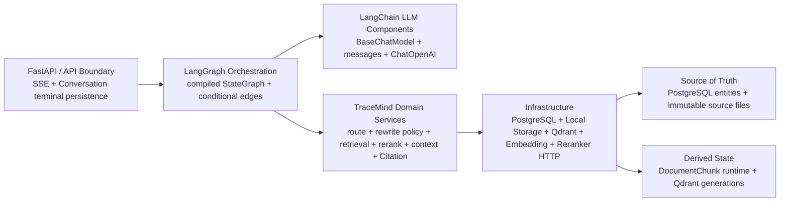

# TraceMind LangChain / LangGraph Architecture Migration Review

> Historical Migration：该评审描述迁移前状态与已完成方案。Production RAG 已迁移到 LangGraph；
> 当前节点、状态、SSE 和 fallback 以代码与 `docs/architecture/TraceMind-Architecture.md` 为准。

## 1. Research date

- 调研日期：2026-08-17
- 当前代码基线：`origin/develop@8262a9893232be8c4beb3dd91de0fe6bd5e04d5e`
- 基线说明：本评审只以该 commit 的源码、测试和冻结评测契约为事实来源，不以 README、旧教程或
  当前工作区以外的实现猜测架构。
- 本轮性质：Architecture Review，只形成后续迁移决策，不实现代码迁移。

重点核对的当前实现包括：

- `backend/app/services/rag.py` 与 `backend/app/api/routes/rag.py`
- query router、query rewrite、retrieval query、RAG retrieval 与 reranking service
- `backend/app/rag/`、`backend/app/llm/`、`backend/app/indexing/qdrant.py`
- Conversation persistence、Citation、StreamingCitationGuard
- Settings、FastAPI lifespan、Provider construction 和相关测试

## 2. Official framework versions

本评审只采用 LangChain/LangGraph 官方文档和官方 GitHub 代码、release 作为框架事实来源。调研时的
稳定版本如下：

| Package | Stable version | 本评审用途 |
|---|---:|---|
| `langchain` | 1.3.15 | 记录框架版本；不建议安装元包 |
| `langchain-core` | 1.5.5 | `BaseChatModel`、messages、Runnable 基础接口 |
| `langchain-openai` | 1.5.1 | `ChatOpenAI` 与 OpenAI-compatible Chat Completions |
| `langgraph` | 1.2.11 | `StateGraph`、runtime context、async/custom streaming |
| `langchain-qdrant` | 1.1.0 | 仅用于能力对比，不建议安装 |

官方参考：

- [LangChain GitHub releases](https://github.com/langchain-ai/langchain/releases)
- [LangGraph GitHub releases](https://github.com/langchain-ai/langgraph/releases)
- [LangChain Models](https://docs.langchain.com/oss/python/langchain/models)
- [LangChain Chat model integrations](https://docs.langchain.com/oss/python/integrations/chat)
- [ChatOpenAI integration](https://docs.langchain.com/oss/python/integrations/chat/openai)
- [LangGraph Graph API](https://docs.langchain.com/oss/python/langgraph/graph-api)
- [LangGraph Streaming](https://docs.langchain.com/oss/python/langgraph/streaming)
- [LangGraph Persistence](https://docs.langchain.com/oss/python/langgraph/persistence)
- [LangChain Qdrant integration](https://docs.langchain.com/oss/python/integrations/vectorstores/qdrant)
- [langchain-qdrant source](https://github.com/langchain-ai/langchain/tree/master/libs/partners/qdrant)

官方当前架构确认：

- `BaseChatModel` 统一消息输入、完整调用、异步调用和 token streaming；消息使用
  `SystemMessage`、`HumanMessage`、`AIMessage`/`AIMessageChunk` 等标准类型。
- structured output 支持 Pydantic、TypedDict 和 JSON Schema，但具体 method 仍取决于 provider 对
  function calling、JSON mode 或 JSON Schema 的真实支持。
- `StateGraph` 以 State、node 和 edge 组织确定性流程；node 可以是同步或异步 Python 函数，条件分支
  使用 conditional edges。
- runtime `context_schema` 用于传递 model、service 或数据库连接等不属于 graph state 的请求依赖。
- LangGraph 支持 `messages`、`updates`、`values`、`custom` 等 stream mode。它们是框架内部能力，
  不等于 TraceMind 的对外产品事件。
- checkpointer 会按 graph step 保存 state snapshot，适合恢复、human-in-the-loop 和 thread memory；
  并非使用 LangGraph 的必要条件。

## 3. Current architecture

### 3.1 Request and persistence boundary

`POST /knowledge-bases/{knowledge_base_id}/rag/stream` 由 FastAPI 原生 SSE 实现。API 在流启动前：

1. 创建 trace id；
2. 如果指定 Conversation，则由 `ConversationService.begin_exchange()` 持久化 user message；
3. 从 PostgreSQL 选择有界且已完成的历史轮次；
4. 组装请求级 `RagService` 和 Retrieval/Reranking dependencies。

API 消费 `RagService.stream_query()` 的产品事件，同时累积经过保护的回答、Sources 和 execution
metadata。`done`、`no_answer`、`error`、disconnect 与 task cancellation 最终由 API 调用
`finish_exchange()` 写入 assistant terminal message。取消后的短事务使用 AnyIO shield，防止已经落库的
user message 永远没有 assistant 终态。

因此 Conversation PostgreSQL 表是对话 Source of Truth，RAG pipeline 不是 Conversation memory。

### 3.2 Current orchestration

`RagService` 当前同时承担：

- 确定性 query routing；
- explicit document path scope resolution；
- history-aware query rewrite；
- query embedding 与 hybrid retrieval；
- optional Cross-Encoder reranking 和 fallback；
- context/source identity construction；
- prompt/message construction；
- direct 与 grounded LLM streaming；
- StreamingCitationGuard；
- pipeline/retrieval/token/no_answer/error/done 事件；
- 各阶段 latency、candidate count、fallback 和 Citation diagnostics。

这已经是一个多阶段、有条件分支、有安全终态的确定性工作流。LangGraph 的价值在于显式表达其状态和
分支，不是把它改成自主 Agent。

### 3.3 Retrieval and generation

`RagRetrievalService` 从 PostgreSQL 读取当前 Document active generations；只有未限定 document/language
时才加入 verified KnowledgeEntry active generations。Query Embedding 继续使用本地
`SentenceTransformerEmbeddingProvider`。

`QdrantGateway` 执行两个独立分支：

- named dense vector + cosine + Dense score threshold；
- named sparse vector + Qdrant server-side BM25 `Document` + `Modifier.IDF`。

两个分支共享 knowledge base、active index generation、document、language 和 excluded chunk type filter，
但具有独立 candidate limit。结果由应用层 zero-based `1 / (2 + rank)`、固定 `k=2` 的 deterministic RRF
融合，并使用内容无关的 stable payload key 处理同分排序。返回值保留 retrieval rank/score、branch candidate
count、Qdrant latency 和 fusion latency。

Cross-Encoder 是独立本地 HTTP Provider。不可用时保持 hybrid Top K，并标记 `hybrid_fallback`，而不是让
整个 RAG 请求失败。

### 3.4 Grounding and citations

`build_rag_context()` 负责：

- 去重；
- context character budget；
- Document 与 verified KnowledgeEntry 的真实 source identity；
- 生成稳定的 `S1`、`S2` source id。

Prompt 将 Conversation History 和 Sources 明确标记为不可信数据，不允许历史回答充当事实或来源。
`StreamingCitationGuard` 跨 token chunk 缓存未完成 Citation，只允许当前真实 Sources 中存在的 source id，
删除伪造 Citation 并记录 valid/invalid count。

### 3.5 Current product events

FastAPI 对外 contract 是 TraceMind 领域事件，而非底层框架事件：

- `pipeline`
- `retrieval`
- `token`
- `no_answer`
- `error`
- `done`

现有 pipeline phase 包括 analyzing、routing、query_rewrite、query_embedding、hybrid_retrieval、candidates、
reranking、generating 和 completed。该命名、顺序、payload、取消行为与 no-answer 行为均属于产品兼容边界。

## 4. Migration matrix

| Component | Current implementation | Framework equivalent | Decision | Reason | Migration risk |
|---|---|---|---|---|---|
| RagService orchestration | 单个 service 显式串联并分支 | LangGraph `StateGraph` | **REPLACE** | 显式 state/edge 能降低编排耦合，并保留确定性 | stream、异常和终态顺序改变 |
| Query router | NFKC/whitelist 的纯函数 | conditional edge | **KEEP** | 不需要 LLM；node 只调用现有函数 | 错误改成模型路由会引入不确定性 |
| Query rewrite | heuristic + manual LLM stream + `json.loads`/精确键与语义校验 | `BaseChatModel.ainvoke` | **ADAPT** | Rewrite 不需要产品 token stream，可减少 accumulation plumbing | provider output、资源与安全边界被放宽 |
| LLM abstraction | `LLMProvider`、`LLMMessage`、`LLMStreamDelta` | `BaseChatModel`、LangChain messages | **REPLACE** | 属于框架已经成熟提供的通用能力 | custom endpoint、异常和 close lifecycle |
| OpenAI-compatible provider | `AsyncOpenAI.chat.completions` wrapper | `ChatOpenAI` | **ADAPT** | 支持 custom `base_url` 和标准 Chat Completions | 非标准 request/response 不保证兼容 |
| Prompt/message construction | TraceMind Prompt + custom message dataclass | LangChain messages | **ADAPT** | Prompt 领域内容必须保留，只替换消息载体 | message content conversion 漂移 |
| RagRetrievalService | Generation selection、Embedding、Qdrant result mapping | LangChain Retriever | **KEEP** | 包含 active generation 与联合来源领域规则 | 通用 Retriever 会隐藏业务诊断 |
| Embedding provider | 本地 SentenceTransformer Provider | LangChain Embeddings | **KEEP** | 当前 Provider、维度和设备策略已验证 | 迁移会改变性能和向量语义 |
| QdrantGateway | 原生 async Qdrant client | `QdrantVectorStore` | **KEEP** | 官方 integration 无法低成本等价覆盖现有语义 | Collection/payload/ranking 回退 |
| Dense retrieval | named cosine vector + branch-only threshold | Qdrant dense mode | **KEEP** | 当前 threshold 和 branch limit 是冻结语义 | threshold 作用位置改变 |
| BM25 sparse retrieval | Qdrant `Document` + `Modifier.IDF` | SparseEmbeddings/FastEmbed | **KEEP** | 当前由 Qdrant 服务端编码；框架方案的数据路径不同 | sparse vector 与 tokenizer 漂移 |
| RRF fusion | 应用侧 deterministic RRF + stable tie break | Qdrant `FusionQuery(RRF)` | **KEEP** | 必须保留可复现排序与 diagnostics | 同分顺序和分数变化 |
| Cross-Encoder reranker | 独立本地 HTTP Provider | Runnable/compressor | **KEEP** | 本地资源、防护和 fallback 是产品策略 | timeout/fallback 变化 |
| Context construction | TraceMind `RagSource` 和 char budget | Document formatter | **KEEP** | Citation identity 与来源类型是领域模型 | 通用 Document 丢失 identity |
| Citation | 真实 Source metadata | 无等价产品语义 | **KEEP** | 引用必须来自真实数据 | Source id 或位置伪造 |
| StreamingCitationGuard | chunk-aware allowlist guard | 无等价内建 guard | **KEEP** | 必须在 token 对外发送前执行 | raw message token 泄漏 |
| FastAPI SSE | 原生 SSE + product events | Graph stream consumer | **ADAPT** | 内部接 graph custom stream，外部 contract 不变 | event ordering/cancellation |
| Conversation persistence | PostgreSQL begin/finish exchange | checkpointer memory | **KEEP** | PostgreSQL 是唯一 Conversation truth | 双份 memory 或终态分裂 |
| Execution metrics/events | RagService 手工事件和 timers | state + custom writer | **ADAPT** | 可由 node 负责自己的观测事件 | framework/task event 重复暴露 |
| KnowledgeEntry retrieval | verified-only generation + typed payload | generic Document retrieval | **KEEP** | verified 状态与来源身份是产品规则 | 自我强化或来源混淆 |
| LangGraph checkpointer/store | 不存在 | checkpointer/store | **DEFER** | 首版没有 resume/HITL/长运行恢复需求 | 第二套 Conversation truth |
| Rewrite structured output | strict prompt JSON | `with_structured_output` | **DEFER** | provider capability 尚未被真实验证 | tool/JSON mode 不受 endpoint 支持 |

## 5. KEEP / REPLACE / ADAPT / DEFER summary

### KEEP

全部 TraceMind 领域正确性和本地数据边界继续保留：query routing、Retrieval、Embedding、QdrantGateway、
Dense/BM25/RRF、Cross-Encoder、context、Citation、StreamingCitationGuard、Conversation persistence 和
KnowledgeEntry retrieval。

### REPLACE

只替换已经由框架稳定提供的通用接口：RagService 的流程编排，以及 LLMProvider/message/delta 通用抽象。

### ADAPT

OpenAI-compatible Provider、Query Rewrite、Prompt message carrier、FastAPI 内部 stream consumer 和
execution events 需要薄适配，以保留 TraceMind 的安全和产品 contract。

### DEFER

首版不使用 checkpointer/store，也不使用 `with_structured_output`。二者只有在出现可证明需求或 provider
capability contract 后才能单独评审。

## 6. Target architecture



### FastAPI / API Boundary

- 输入校验和 404/503 映射；
- begin/finish Conversation exchange；
- 只消费 TraceMind custom events；
- attach conversation/message id；
- disconnect detection 与 shielded terminal persistence。

### LangGraph Orchestration

- 固定、无循环 StateGraph；
- 只表达步骤边界、条件分支、状态转换和 custom event emission；
- 不拥有数据库事务、Qdrant implementation 或 Conversation memory。

### LangChain LLM Components

- `BaseChatModel` 作为 node/query rewrite 的 model interface；
- `SystemMessage`/`HumanMessage` 作为 prompt carrier；
- `ChatOpenAI` 作为当前 OpenAI-compatible integration；
- TraceMind 保留异常净化、超时、provider capability 和 lifecycle 约束。

### TraceMind Domain Services

- 继续实现 Retrieval、Reranking、Context、Citation 和 Rewrite policy；
- Graph node 调用这些 service，不在 node 内复制算法。

### Infrastructure

- 继续使用现有 SQLAlchemy、Qdrant async client、SentenceTransformer 和本地 Reranker HTTP；
- LangChain 不反向接管数据层或索引结构。

### Source of Truth / Derived State

- PostgreSQL KnowledgeBase、Document、DocumentVersion、Conversation、Message、KnowledgeEntry 和原文件是
  Source of Truth；
- Chunk/index runtime 与 Qdrant points 是可审计、可修复、可重建的 Derived State；
- LangGraph State 只是单次请求 execution state，不是新的业务数据源。

## 7. Target graph

```text
START -> route

route:
  direct -> generate_direct -> finalize -> END
  rag -> rewrite -> retrieve -> rerank -> prepare_context

prepare_context:
  sources -> generate_grounded -> finalize -> END
  empty -> finalize(no_answer) -> END

known terminal failure -> finalize(error) -> END
unexpected failure -> raise
```

### Real graph nodes

| Node | Responsibility | 不负责 |
|---|---|---|
| `route` | 调用 deterministic router，记录 routing metadata | LLM classification |
| `rewrite` | scope resolution、history-aware rewrite、fallback state | Retrieval |
| `retrieve` | 调用正式 Retrieval service，保留 embedding/Qdrant diagnostics | 重写 Qdrant 查询 |
| `rerank` | 调用正式 Reranker 并映射已有 fallback | 实现 Cross-Encoder |
| `prepare_context` | 调用 context/prompt builder，决定 sources/empty branch | 自造 Citation |
| `generate_direct` | direct prompt + ChatModel streaming | Retrieval/Citation |
| `generate_grounded` | grounded streaming + Citation Guard | 绕过 Guard 输出 raw token |
| `finalize` | 将已知 outcome 变成 TraceMind terminal custom event | Conversation DB commit |

`route_query`、path resolver、RagRetrievalService、QdrantGateway、DocumentRerankingService、context builder、
prompt builder 和 StreamingCitationGuard 仍是普通 Python/domain components。把它们全部改成 node 只会增加
graph 噪音和 state coupling。

分支使用静态 edge 和 `add_conditional_edges`。不使用 `Command` 动态规划，不存在 loop、tool selection 或
agent decision。

## 8. Graph State / Runtime Context design

### Graph lifetime

Graph builder 在应用初始化阶段执行，compiled graph 放入 application state，整个 FastAPI lifespan 只 compile
一次。HTTP 请求不得重新 build/compile graph。

### Input state

建议 `RagGraphInput` 只包含可描述单次执行的值：

- `trace_id`
- `knowledge_base_id`
- `original_query`
- `language`
- `document_id`
- bounded `conversation_history`
- optional `conversation_id`，仅用于 tracing
- `started_at`

### Internal state

`RagState` 保存：

- route mode 与 routing latency；
- prepared/scoped retrieval query；
- query rewrite result 与 fallback reason；
- prepared hybrid search 和 retrieval results；
- rerank outcome；
- RagContext、sources 与 LangChain messages；
- embedding、Qdrant、fusion、rerank、LLM 和 total timing；
- candidate counts；
- guarded answer text、finish reason、Citation counts；
- known terminal kind 和安全 public error metadata。

`RagState` 明确禁止保存：

- SQLAlchemy Session；
- Qdrant client；
- Settings；
- BaseChatModel；
- Reranking service；
- Repository；
- 其他 infrastructure client、连接或 request-scoped dependency。

### Runtime context

通过 `StateGraph(..., context_schema=RagRuntimeContext)` 和 invocation `context` 传入：

- Settings；
- BaseChatModel/lifecycle wrapper；
- 请求级 RagRetrievalService；
- 请求级 Query Rewrite service；
- optional DocumentRerankingService。

这些 dependency 可以间接持有当前请求的 SQLAlchemy session 或 infrastructure client，但不得写入 State、
custom event 或 checkpoint。如果未来某个 node 确实需要直接 Repository/client，也只能通过 runtime context 注入；
优先仍应注入封装业务边界的 TraceMind service。Graph 本身仍可在 lifespan 中只 compile 一次。

### Output state

Graph output 只需要提供 API 最终持久化和 diagnostics 所需内容：terminal status、guarded answer、Sources、
finish reason、Citation count 和 execution metadata。第一版不把 output 当作 Conversation memory。

## 9. Streaming mapping

### Product event boundary

FastAPI SSE 对外事件必须始终来自 TraceMind custom events。禁止把 LangGraph `messages`、`updates`、`values`、
`tasks` 或 `debug` 直接改名后发送到前端。

原因：

- `messages` 可能包含尚未经过 Citation Guard 的 raw model token；
- `updates`/`values` 可能包含 history、source content 和内部 state；
- framework event shape/version 不应成为前端 contract；
- TraceMind 需要稳定的 phase、fallback 和 domain diagnostics。

建议 graph runner 使用 `graph.astream(..., stream_mode="custom", version="v2")`。node 通过 custom writer 发出
完整的 TraceMind event envelope，API 只验证和转发这个 channel。

### Mapping

| TraceMind event | Graph producer | Compatibility rule |
|---|---|---|
| `pipeline` | 各 node | phase/status/order 与现有 contract 一致 |
| `retrieval` | direct 或 `prepare_context` | sources、scope、metrics 不变 |
| `token` | direct/grounded generation | grounded token 必须先过 Citation Guard |
| `no_answer` | `finalize` | message、scope、route mode 不变 |
| `error` | `finalize` 处理已知 terminal error | 只含安全 code/message/metadata |
| `done` | `finalize` | finish reason、Citation、timing 不变 |

### Grounded token path

```text
BaseChatModel.astream
  -> AIMessageChunk text
  -> StreamingCitationGuard.push
  -> guarded non-empty text
  -> TraceMind custom token event
  -> FastAPI SSE
```

stream finish 时必须调用 `StreamingCitationGuard.finish()`。final state 和 `done` 使用同一 guard 的
grounded/valid/invalid counts，不允许另建一套 Citation parser。

## 10. Cancellation / error semantics

### Cancellation

所有 async graph node 和薄 adapter 必须把 `asyncio.CancelledError` 视为 control flow：

```python
except asyncio.CancelledError:
    raise
```

不得转换成：

- Query Rewrite fallback；
- Retrieval unavailable；
- LLM unavailable；
- generic graph error state；
- `done` 或普通 `error` event。

取消继续传播到 FastAPI。API 负责关闭 graph/model async stream，并以 shielded terminal transaction 把已经开始的
Conversation exchange 标记为 cancelled。该边界保持现有设计。

### Known outcomes

只有以下已知业务结果可以写入 graph outcome：

- Query Rewrite timeout/provider-safe error/empty/overlong/invalid response：原 query fallback；
- no active generation/no context：no-answer；
- Reranker unavailable/known Reranker error：hybrid fallback；
- known Retrieval unavailable：安全 `retrieval_unavailable` terminal error；
- known ChatModel gateway unavailable/interrupted：安全 `llm_unavailable` terminal error。

### Unexpected errors

`TypeError`、`AssertionError`、非法 state、framework misuse 和未分类 programming errors 不得被 node 吞掉并伪装
为产品 error state。它们必须继续抛出，由 FastAPI 最外层按现有失败补偿处理并留下 server-side traceback。对外不得
包含 upstream response、API key、query/source content 或 private endpoint。

node 只能捕获明确列出的 domain/provider exception 类型，不允许用 `except Exception` 把整个 node 包装成
`retrieval_unavailable` 或 `llm_unavailable`。基础设施层已有的安全异常映射可以继续复用，但 Graph migration 不得
扩大其捕获范围。

## 11. Persistence decision

第一版 compiled graph 不传 checkpointer，不传 store，也不使用 LangGraph thread memory。

理由：

- 当前 graph 是单 HTTP 请求内完成的无循环流程；
- 没有 human-in-the-loop、interrupt/resume 或跨进程长运行执行；
- FastAPI 已在 PostgreSQL 中可靠持久化 Conversation terminal state；
- checkpointer 会增加第二套 thread state、序列化、retention、删除和隐私边界；
- request cancellation 需要终止当前模型调用，而不是自动 resume。

如果未来出现真正需要恢复的长运行工作流，必须单独设计 execution checkpoint，明确它与 Conversation message 的
ownership、幂等键、retention 和删除闭包；不得直接用 checkpointer 替换现有 Conversation 表。

## 12. Qdrant decision

结论：**KEEP current QdrantGateway，不增加 langchain-qdrant，也不增加 thin VectorStore adapter。**

官方 `QdrantVectorStore` 支持 named vectors、Dense/Sparse/Hybrid 和 metadata filter，但当前实现差异包括：

| TraceMind requirement | Current QdrantGateway | LangChain integration gap/risk |
|---|---|---|
| named dense/sparse vectors | 两个名称独立配置并执行 schema 验证 | 支持 named vectors，但不足以证明整体等价 |
| Qdrant BM25 `Document` | 服务端 text-to-sparse | 默认要求 `SparseEmbeddings`，数据路径不同 |
| `Modifier.IDF` | collection 创建与在线兼容验证 | 通用 wrapper 不覆盖当前全部升级/验证逻辑 |
| Dense threshold | 只应用在 Dense branch | hybrid wrapper 的 threshold 位置/语义不同 |
| independent branch limits | Dense/Sparse 分别配置 | wrapper prefetch 使用统一 `k` |
| active `index_generation` | PostgreSQL 选择 active generations，Qdrant 使用 `MatchAny` | 可传 filter，但 ownership 仍需 TraceMind 计算 |
| filter contract | KB + optional document/language + excluded chunk types (`must_not`) | 可传 filter，但没有领域 invariant |
| deterministic RRF | 应用层固定算法和 tie break | wrapper 默认交给 Qdrant FusionQuery |
| diagnostics | branch count/rank/score/timing | VectorStore 返回接口不足 |
| payload identity | Document + KnowledgeEntry typed payload | 默认 page_content/metadata mapping 不等价 |
| audit/repair/delete | generation/point metadata primitives | 不属于通用 VectorStore 的安全闭包 |

Graph 的 `retrieve` node 继续调用 RagRetrievalService；LangGraph 不要求 service 实现 LangChain Retriever。

## 13. LLM migration decision

### Replace generic abstractions

迁移完成后可删除：

- `LLMProvider` Protocol；
- `LLMMessage`；
- `LLMStreamDelta`；
- 只做标准 Chat Completions/message/delta 转换的自研 provider plumbing。

Service/node 以 `BaseChatModel` 为 model interface，Prompt 使用 `SystemMessage`/`HumanMessage`，answer 使用
`astream()`，Rewrite 使用 `ainvoke()`。

### Keep TraceMind responsibilities

以下不是 LangChain 应替代的职责：

- Settings validation；
- provider capability declaration；
- safe exception classification；
- cancellation propagation；
- timeout；
- owned HTTP resource lifecycle；
- prompt injection boundary；
- Citation Guard；
- public error contract。

### ChatOpenAI configuration

custom OpenAI-compatible endpoint 使用：

- `base_url=settings.llm_base_url`；
- `model=settings.llm_model`；
- `use_responses_api=False`，固定 Chat Completions；
- 当前 temperature、max token 和 timeout；
- API key 缺省时继续使用非空 placeholder；
- provider-specific request 参数放入 `extra_body`。

`enable_thinking` 可以通过 `extra_body` 透传，但“LangChain 可以传”不等于“当前 provider 支持”。迁移 phase 必须
使用真实 configured provider 做 smoke test，验证：

1. `False`、`True` 和未设置三种请求；
2. 普通完整调用；
3. async streaming；
4. cancel/close；
5. provider 错误不泄漏 private body。

第三方 endpoint 的非标准 response fields 不作为第一版能力；如果产品以后依赖 reasoning metadata，应选择专用
integration 或实现最小 BaseChatModel adapter，而不是假设 ChatOpenAI 会保留它们。

## 14. Query Rewrite migration decision

结论：**ADAPT 到 BaseChatModel.ainvoke，但第一版不用 `with_structured_output`。**

Rewrite 不需要向用户输出 token。使用非流式 `ainvoke()` 可以删除手工 stream accumulation，但不得放宽当前安全
边界。当前基线实际使用 `json.loads()`、精确 `{"action", "query"}` 键集合和手工语义校验；Pydantic
extra-forbid model 是迁移目标，不应被误写成当前已经存在的实现。目标实现必须保持以下顺序：

1. 无 history 返回 `not_applicable`；
2. `requires_history` heuristic 不命中返回 `skipped`，不调用模型；
3. 只接收由 `ConversationService` 按 `query_rewrite_history_max_turns` 和
   `query_rewrite_history_max_chars` 截断的 completed turns；node 不得重新读取无界历史；
4. 使用相同 system prompt 和 JSON untrusted payload，保持 Conversation History 和 Current Question 均为
   不可信数据的 prompt-injection boundary；
5. 使用 `asyncio.timeout(query_rewrite_timeout_seconds)`；
6. `ainvoke()` 使用不宽于当前 provider 的 completion-token budget；不得因改成非流式调用而使用无界默认输出。
   真实 provider smoke test 必须确认最终请求字段确实被 endpoint 接受；
7. 从完整 `AIMessage` 做 allowlist 式 text-only extraction：接受纯字符串，或只包含标准 text block 的内容；遇到
   non-text/unknown block、无法识别的 content shape 时按 `invalid_response` 回退，禁止 `str(content)`；
8. 在 JSON 解析前执行当前精确字符上限：`max_query_chars * 2 + 200`。`ainvoke()` 无法像当前 streaming collect
   一样在越界瞬间关闭流，因此必须同时保留第 6 项上游 token budget 和本项客户端字符拒绝；
9. 空文本返回 `empty_output` fallback；
10. raw text 以 code fence 开头或结尾时拒绝；
11. 使用 extra-forbid Pydantic model 的 `model_validate_json()`；
12. 只允许 `action` 为 `keep`/`rewrite`，`query` 必须是 string、strip 后非空且不超过
    `query_rewrite_max_query_chars`；
13. `keep` 使用原 query，`rewrite` 使用 candidate；
14. timeout、known provider error、overlong 或已知 parse/schema/semantic validation failure 均回退原 query，并保留当前
    fallback reason；
15. 只捕获明确的 timeout、safe provider、JSON/Pydantic validation exception；`CancelledError` 与 unexpected
    programming error 继续抛出。

Pydantic schema 使用 `extra="forbid"`，因此不能接受多余 key。保留当前 `action/query` 语义，而不是只验证“JSON
可解析”。

暂缓 `with_structured_output` 的原因是它最终依赖 provider 对 function calling、JSON mode 或 JSON Schema 的
实现。只有真实 provider capability smoke test 和 fallback compatibility test 通过后，才能单独评审启用。

## 15. Dependency decision

第一轮未来迁移建议收紧到同一 minor line：

```toml
"langchain-core>=1.5.5,<1.6"
"langchain-openai>=1.5.1,<1.6"
"langgraph>=1.2.11,<1.3"
```

精确 resolved version 交给 `uv.lock`。每次升级 minor boundary 都需要重新检查 streaming、runtime context、
ChatOpenAI 参数和 graph tests。

不安装：

- `langchain` 元包；
- `langchain-qdrant`；
- `langgraph-checkpoint-*`；
- Agent/tool/community integration package；
- LangSmith runtime dependency。

当前项目约束为 `openai>=2.46,<3`。Architecture Review 不以静态范围推断最终依赖解一定可用；真正新增依赖时必须
执行 `uv lock`，检查 resolver 结果、license/dependency diff 和安全扫描。本 Architecture Review 不修改
`pyproject.toml` 或 `uv.lock`。

## 16. Migration phases

### Phase 0 — Characterization gates

- 冻结 SSE event snapshots、Prompt payload、Citation、Conversation terminal 和 cancellation tests；
- 增加 graph migration parity fixtures，但不引入 framework；
- 记录当前 24 Case 和 latency/cost 基线；
- 回滚：仅删除新增测试，不影响产品。

### Phase 1 — Dependencies and ChatModel factory

- 增加三项收紧依赖并更新 lock；
- 在 lifespan 构造 ChatOpenAI/runtime resource；
- 运行真实 provider smoke test；
- API 继续使用旧 RagService；
- 回滚：移除 factory/dependencies，旧路径未变。

### Phase 2 — Messages and Query Rewrite

- Prompt carrier 改为 LangChain messages；
- Query Rewrite 改为 `ainvoke` + Pydantic validation；
- 保留旧 RagService orchestration；
- 所有 rewrite/security tests 绿色后独立提交；
- 回滚：恢复自研 message/provider 调用，不涉及 Retrieval。

### Phase 3 — Compiled graph and nodes

- 增加 State、Runtime Context、node 和 graph builder；
- app initialization compile 一次；
- 只通过 test-only parity harness 调用新 graph；
- 不新增生产 feature flag，不切换 SSE；
- 回滚：删除未接线 graph，不影响现有请求。

### Phase 4 — Custom streaming adapter and cutover

- 使用 custom-only stream adapter；
- grounded tokens 通过 Citation Guard；
- 通过 path/event/cancellation/Conversation parity 后切换 FastAPI；
- 旧实现只在相邻可回滚提交中短期保留，不形成永久双引擎；
- 回滚：revert cutover commit。

### Phase 5 — Remove obsolete abstractions

- 删除旧 RagService orchestration 和自研通用 LLM message/delta/protocol；
- 保留 TraceMind domain services、安全异常与 provider lifecycle；
- 全量、24 Case、真实 PostgreSQL/Qdrant、provider smoke 和性能门禁全部通过后完成迁移。

每个 phase 必须可以独立测试和 revert。不得将上述阶段合并为 Big Bang rewrite。
每个 phase 的入口和出口都必须保持生产路径可用；test-only parity harness 不得被产品流量调用。Phase 4 cutover
前旧路径仍是唯一生产路径，cutover 后旧实现只允许短期存在于相邻、可 revert 的提交窗口中。

## 17. Test gates

### Unit and node tests

- route normalization/direct whitelist；
- rewrite not-applicable/skipped/rewritten/all fallback reasons；
- history turn/char bounds、completion-token budget、text-only content extraction；
- output size、code fence、non-text block、extra key、invalid action、empty/overlong query；
- retrieve empty generation、Embedding failure、Qdrant failure；
- reranker disabled/success/unavailable/invalid response；
- context budget、Document/KnowledgeEntry identity；
- Citation split across chunks、invalid Citation removal、finish tail；
- known error outcome 与 unexpected error propagation；
- State 不包含 Session、Settings、model、service、Repository 或 infrastructure client。

### Graph path tests

- direct：不调用 Rewrite/Retrieval/Reranker/Citation Guard；
- RAG happy path；
- rewrite fallback 后继续原 query；
- no active generation/no source；
- reranker fallback；
- retrieval unavailable；
- LLM start failure 与 mid-stream failure；
- Graph 只在 application initialization compile 一次；
- 两个并发请求使用各自 runtime context，不串 session/service/state。

### Streaming/SSE tests

- 只消费 custom channel；
- messages/updates/values 即使存在也不得进入 SSE；
- pipeline phase、status、candidate count、fallback reason 顺序；
- grounded raw token 在 Guard 前不可观察；
- direct token 不错误添加 Citation；
- retrieval/no_answer/error/done payload snapshot 与现有 contract 一致；
- first-token、generation、total 和 persistence latency 字段；
- no-answer 有 done；已知 error 保持当前无 done 语义。

### Cancellation and persistence tests

- graph 启动前 cancellation；
- Rewrite/Retrieval/LLM 中 cancellation；
- first token 前后 client disconnect；
- async stream 确实 close；
- user message 已提交时 assistant terminal 为 cancelled；
- completed/no_answer/failed/cancelled 的 content、Sources 和 metadata 与当前一致；
- `CancelledError` 从 node 传播而非普通 outcome。

### Provider tests

- custom base URL 使用 Chat Completions，不误走 Responses API；
- API key placeholder、timeout、temperature、token limit；
- `extra_body.enable_thinking` 的真实 provider smoke；
- non-standard response 缺失时不依赖该字段；
- upstream response/body/endpoint 不进入 public error。

### Repository gates

- 后端 Ruff check/format、mypy、全量 pytest；
- 相关前端 typecheck、Vitest 和 build，证明 SSE contract 无需同步改造；
- 真实 PostgreSQL/Qdrant integration；
- 迁移不修改 Qdrant collection 或 payload schema；
- migration 不需要 Alembic revision。

### Retrieval quality gate

冻结 24 Case corpus、dataset、expected、baseline、threshold、Dense/BM25/RRF/Top K 不变。继续执行现有
regression policy：Recall@5 下降超过 0.02、MRR@5 下降超过 0.03、All-required@5 下降超过 0.02 或 Hit@1
下降超过 0.05 时失败；P95 增加超过 50% 继续作为 warning，但必须记录 graph overhead、首 token、总延迟和
成本。不得通过调整 baseline 或重建直到偶然通过来掩盖回退。

## 18. Risks

| Risk | Impact | Mitigation |
|---|---|---|
| LangChain dependency surface | 安装体积、传递依赖、安全维护增加 | 只装 core/openai/graph，minor 上界收紧 |
| LangGraph API churn | stream/context API 变化 | 固定 `<1.3`、lock 精确版本、升级单独评审 |
| Streaming semantic difference | event 顺序或 raw token 泄漏 | custom-only adapter + SSE snapshots |
| Message conversion | Prompt/content 结构变化 | Prompt payload characterization tests |
| Rewrite resource boundary | `ainvoke` 无法按字符数中途关闭当前 response | 上游 token budget + text-only extraction + 解析前精确字符上限 |
| OpenAI-compatible differences | 请求失败或 metadata 丢失 | `use_responses_api=False` + 真实 smoke test |
| `extra_body` false confidence | 能透传但 provider 不支持 | 对每个能力做 endpoint-level proof |
| Cancellation swallowed | 模型继续运行或 Conversation pending | 显式 re-raise + disconnect/cancel tests |
| Error over-catching | programming bug 被伪装成 503 | 只 catch 已知 domain error |
| Observability duplication | framework/product metrics 冲突 | 只暴露 TraceMind custom events |
| State privacy | history/source 通过 values/debug 泄漏 | API 不消费/转发非 custom stream |
| Checkpointer duplication | 第二套 Conversation truth | 第一版不配置 checkpointer/store |
| Qdrant semantic regression | Recall/rank/Citation 变化 | KEEP Gateway + frozen 24 Case |
| Performance regression | graph/provider overhead | 分阶段 latency/cost comparison |
| Permanent dual engine | 双路径长期漂移 | test-only parity，cutover 后删除旧实现 |
| Remote tracing/data transfer | 本地内容外发 | 默认不启用 LangSmith 或远程 tracing |

## 19. Explicit non-goals

本迁移明确不引入或探索：

- Agent loop；
- Tool calling；
- Planner；
- Multi-Agent；
- GraphRAG；
- HyDE；
- Step-Back；
- LLM relevance grader；
- autonomous query retry/reflect loop；
- Qdrant、Embedding 或 Reranker replacement；
- Collection/payload/index migration；
- LangGraph checkpointer、store 或 Conversation memory；
- frontend SSE contract rewrite；
- LangSmith remote tracing；
- Stage 18。

## 20. Final recommendation

**建议在本 Architecture Review 获得确认后开始分阶段代码迁移。**

推荐理由：当前 841 行级 RagService 已经表达多个确定性阶段、分支、fallback、stream event 和 terminal outcome；
使用无循环 StateGraph 可以让 orchestration boundary 更清晰，并用标准 BaseChatModel/messages 删除低价值通用
plumbing。

该建议不是“全面 LangChain 化”：

- 不建议迁移 QdrantGateway；
- 不建议迁移 Embedding、Reranker、Context、Citation 或 Conversation persistence；
- 不建议引入 Agent；
- 不建议第一版使用 structured output/checkpointer；
- 不允许改变 Retrieval、Citation、SSE、Cancellation、no-answer 或冻结评测语义。

代码迁移只有在每个 phase 可独立测试和回滚、真实 provider smoke test 通过、SSE/Citation/Conversation parity
成立、全量与 24 Case 门禁绿色后，才能完成最终 cutover。
